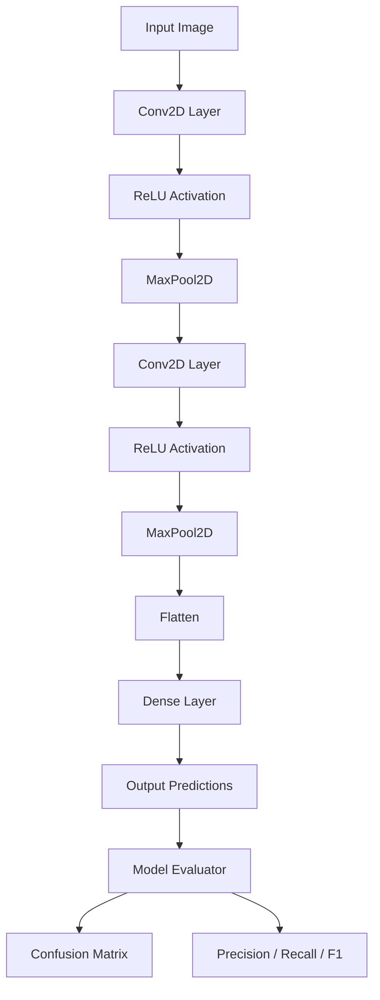
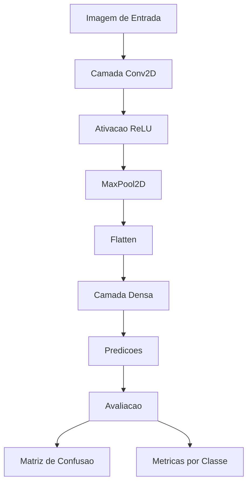

# Deep Learning Computer Vision Framework

<div align="center">


</div>

**[English](#english)** | **[Portugues (BR)](#portugues-br)**

---

## English

### Overview

A deep learning framework for computer vision built from scratch using NumPy. Implements CNN layers (Conv2D with forward/backward, MaxPool2D, Flatten, Dense), an image augmentation pipeline, and model evaluation with confusion matrix and classification metrics.

### Architecture



### Data Pipeline

```mermaid
flowchart LR
    subgraph Augmentation
        A1[Original Images] --> A2[Horizontal Flip]
        A2 --> A3[Brightness Adjustment]
        A3 --> A4[Random Noise]
        A4 --> A5[Random Crop]
    end
    subgraph Training
        A5 --> B1[Forward Pass - CNN]
        B1 --> B2[Loss Computation]
        B2 --> B3[Backward Pass]
        B3 --> B4[Weight Update]
    end
    subgraph Evaluation
        B4 --> C1[Predictions]
        C1 --> C2[Confusion Matrix]
        C2 --> C3[Classification Report]
    end
```



### Features

- **Conv2D Layer**: 2D convolution with configurable kernel size, stride, padding, and full backpropagation
- **MaxPool2D**: Max pooling with backward pass gradient routing
- **Image Augmentation**: Flip, brightness, noise, crop, center crop, normalization
- **Evaluation**: Confusion matrix, per-class precision/recall/F1, classification report

### Usage

```python
from src.cnn_layers import Conv2D, MaxPool2D, Flatten, Dense, ReLU
from src.augmentation import ImageAugmentor
from src.evaluation import ModelEvaluator

# Build CNN architecture
conv1 = Conv2D(1, 8, kernel_size=3, padding=1, seed=42)
relu = ReLU()
pool = MaxPool2D(pool_size=2)
flatten = Flatten()

# Augment training data
augmentor = ImageAugmentor(seed=42)
augmented = augmentor.augment(image)

# Evaluate model
evaluator = ModelEvaluator()
print(evaluator.classification_report(y_true, y_pred, class_names))
```

### Running Tests

```bash
pytest tests/ -v
```

### Author

**Gabriel Demetrios Lafis**
- [GitHub](https://github.com/galafis)
- [LinkedIn](https://www.linkedin.com/in/gabriel-demetrios-lafis-62197711b)

---

## Portugues BR

### Visao Geral

Um framework de deep learning para visao computacional construido do zero usando NumPy. Implementa camadas CNN (Conv2D com forward/backward, MaxPool2D, Flatten, Dense), pipeline de aumento de imagens e avaliacao de modelo com matriz de confusao e metricas de classificacao.

### Arquitetura



### Funcionalidades

- **Camada Conv2D**: Convolucao 2D com kernel, stride, padding configuraveis e retropropagacao completa
- **MaxPool2D**: Pooling maximo com roteamento de gradiente
- **Aumento de Imagens**: Espelhamento, brilho, ruido, recorte, normalizacao
- **Avaliacao**: Matriz de confusao, precisao/recall/F1 por classe

### Executando os Testes

```bash
pytest tests/ -v
```

---

## License

MIT License - see [LICENSE](LICENSE) for details.
